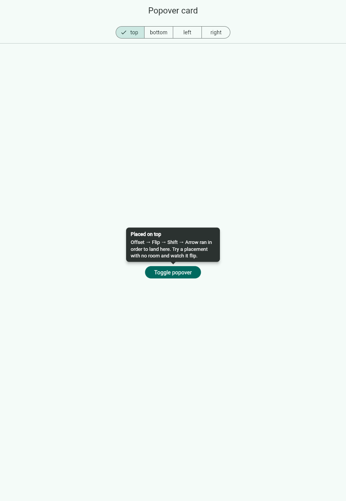
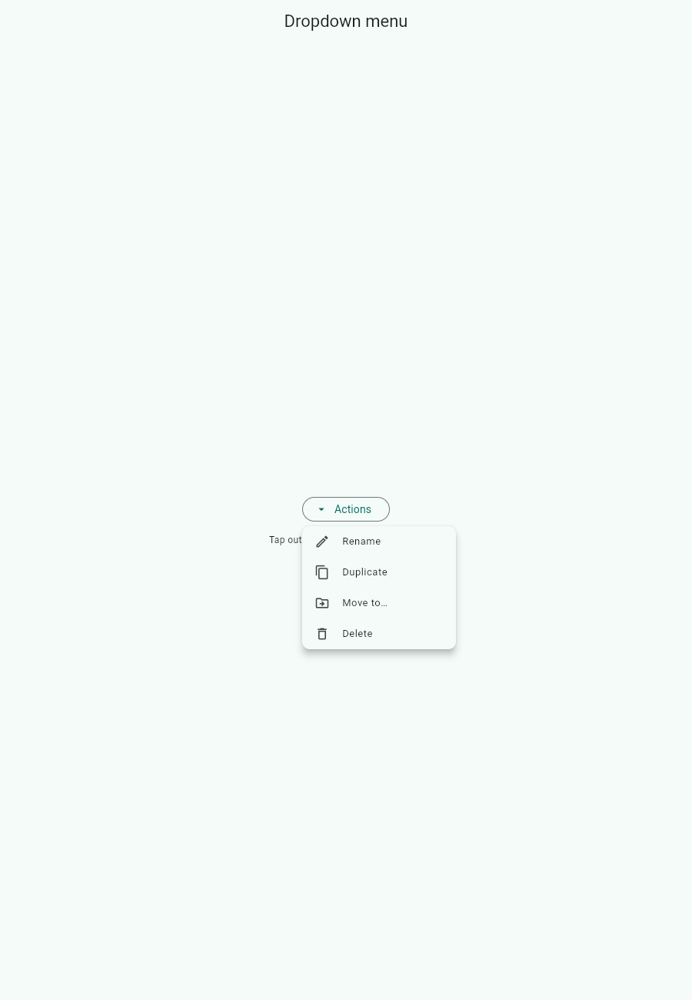
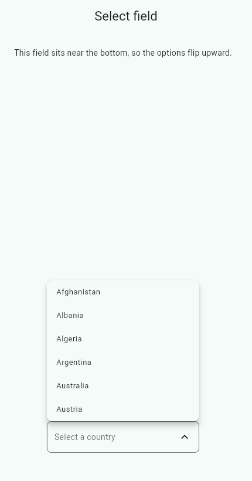
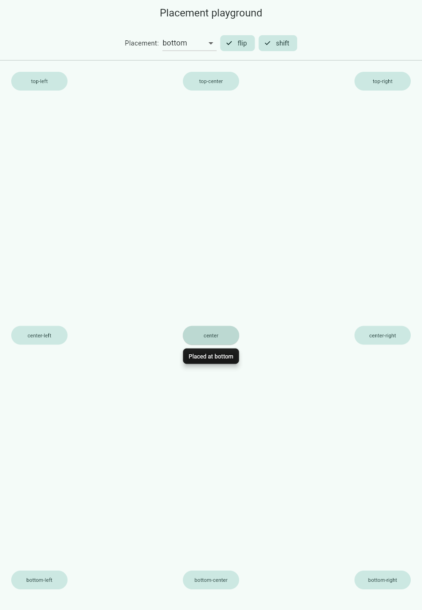
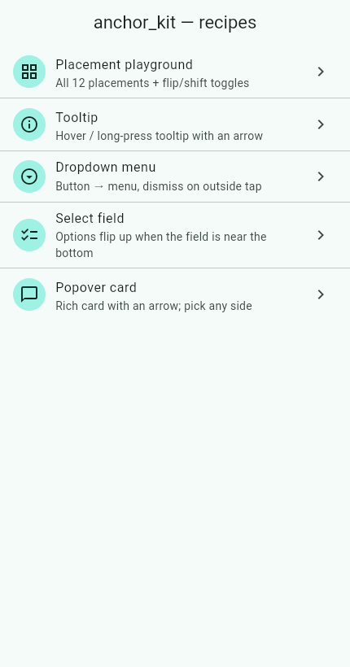

# anchor_kit

[](https://pub.dev/packages/anchor_kit)
[](LICENSE)

**Headless anchor-positioning primitives for Flutter** — the reusable engine
behind popovers, tooltips, dropdowns, context menus and select inputs.
Inspired by [Floating UI](https://floating-ui.com/) (formerly Popper.js).

Flutter ships great `Tooltip` and menu widgets, but there's no reusable engine
that composes a positioning strategy from small, testable pieces (offset, flip,
shift, arrow). `anchor_kit` is that missing primitive: a pure `computePosition`
function plus a `FloatingOverlay` widget, so higher-level UI kits don't have to
reinvent placement math.

> **Status:** `0.1.0` — early but usable. The core is covered by tests and runs
> on every platform (mobile, desktop, **web**). Some middleware from Floating UI
> is not implemented yet — see [Known limitations](#known-limitations).

<p align="center">
  
</p>

## What can you build with it?

It's **not popover-only** — it positions *any* floating element relative to an
anchor. The example app ships these recipes:

| Tooltip | Dropdown menu | Select (flips up) |
|---|---|---|
|  |  |  |

| Popover + arrow | Placement playground | Recipe gallery |
|---|---|---|
|  |  |  |

Run them yourself:

```bash
cd example
flutter run              # mobile / desktop
flutter run -d chrome    # web
```

## Install

```yaml
dependencies:
  anchor_kit: ^0.1.0
```

## Quick start

```dart
FloatingOverlay(
  isOpen: open,
  placement: Placement.bottomStart,
  middleware: [
    OffsetMiddleware(8),   // gap from the anchor
    Flip(padding: 8),      // flip to the other side if there's no room
    Shift(padding: 8),     // slide back on-screen if it overflows
  ],
  barrierDismissible: true,           // tap outside to close
  onDismiss: () => setState(() => open = false),
  floating: (context, position) => Material(
    elevation: 8,
    child: Padding(
      padding: const EdgeInsets.all(12),
      child: Text('Placed on ${position.placement.side.name}'),
    ),
  ),
  child: ElevatedButton(
    onPressed: () => setState(() => open = !open),
    child: const Text('Open'),
  ),
)
```

Or use the pure function with no widgets at all — great for tests:

```dart
final result = computePosition(
  anchor: Rect.fromLTWH(100, 200, 40, 40),
  floating: const Size(180, 60),
  viewport: Rect.fromLTWH(0, 0, 400, 800),
  placement: Placement.top,
  middleware: [Flip(), Shift()],
);
// result.offset, result.placement, result.middlewareData['flipped']
```

## Concepts

### Placement

Where the floating element goes relative to the anchor: a **side**
(`top`/`right`/`bottom`/`left`) × an **alignment** (`start`/`center`/`end`) =
12 placements (`Placement.top`, `Placement.bottomStart`, …).

### Middleware

Small composable rules, run **in order**, each adjusting the position. Recommended
order: **`OffsetMiddleware` → `Flip` → `Shift` → `Arrow`**.

- **`OffsetMiddleware(distance, {crossAxis})`** — pushes the floating element
  away from the anchor (the gap). `crossAxis` nudges along the perpendicular
  axis.
- **`Flip({padding})`** — if the current side would overflow, flips to the
  opposite side. If neither side fully fits, keeps the one that overflows least.
- **`Shift({padding, mainAxis, crossAxis, rtl})`** — slides the element along the
  viewport so it stays visible, **without changing the side**. Clamps the **main
  axis** (parallel to the anchor edge) by default; `crossAxis: true` also clamps
  toward the anchor (can detach it); `rtl: true` keeps the right edge for
  oversized elements.

  ```
  Without Shift:              With Shift:
  ┌─────────────┐            ┌─────────────┐
  │        [btn]│            │        [btn]│
  │        ┌────┼── ✂        │     ┌──────┐│
  │        │ popover         │     │popover ││ ← slid inward
  └─────────────┘            └─────────────┘
  ```

  (`Flip` changes the side; `Shift` keeps the side and moves along the edge.
  They're usually used together.)
- **`AutoPlacement({padding, candidates})`** — chooses the side with the most
  room (keeps the current side if it fits, else least overflow). Use *instead of*
  `Flip`. Records the pick in `data['autoPlacement']`.
- **`SizeMiddleware({padding})`** — reports the space available on the resolved
  side in `data['size'] = {availableWidth, availableHeight}`, so a long menu can
  cap its height to the viewport and scroll internally. See the "Size" example
  recipe.
- **`Hide({padding})`** — flags `data['hide'] = {referenceHidden}` when the anchor
  scrolls off-screen, so you can hide the floating element.
- **`Arrow({padding, arrowSize})`** — computes where a little arrow should sit so
  it points at the anchor's centre. Read it from
  `position.middlewareData['arrow']` (`{x?, y?}`) — see `ArrowBubble` in the
  example for a ready-made bubble.

`computePosition` returns a `PositionResult` with the final `offset`, the
resolved `placement` (after any flip), and a `middlewareData` map that middleware
write into (`flipped`, `shift`, `arrow`).

## `FloatingOverlay`

Renders `floating` into the app `Overlay` while `isOpen`, and keeps it glued to
the anchor:

- **Follows the anchor** every frame — ancestor scrolling, window
  resize/rotation, or the anchor moving all re-position it.
- **Re-measures** the floating child, so content that changes size stays placed.
- Optional **`barrierDismissible` + `onDismiss`** for tap-outside-to-close
  (dropdowns / selects / popovers).

## Known limitations

Honest scope (vs. Floating UI). None are blockers for the use cases above:

- No virtual/rect reference elements — the anchor is always a widget.
- `FloatingOverlay` provides positioning + an optional dismiss barrier, but not
  focus trapping / keyboard navigation / enter-exit animation — compose those
  yourself for now.
- Middleware run in a single pass; `SizeMiddleware` reports available space and
  the floating element settles to fit over one extra frame (fine in practice, as
  `FloatingOverlay` re-measures every frame).

See [`doc/ROADMAP.md`](doc/ROADMAP.md) and [`doc/SPEC.md`](doc/SPEC.md).

## License

MIT
